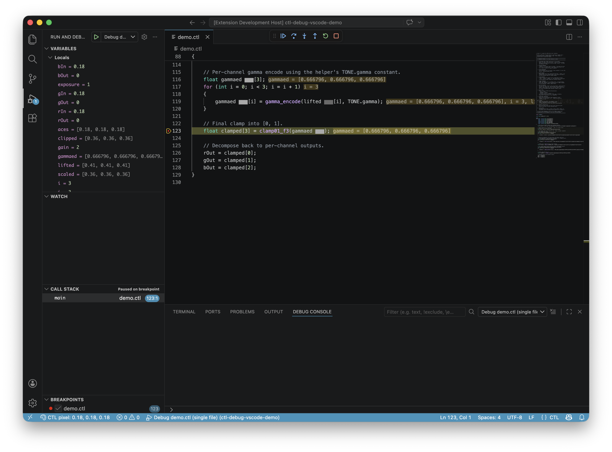
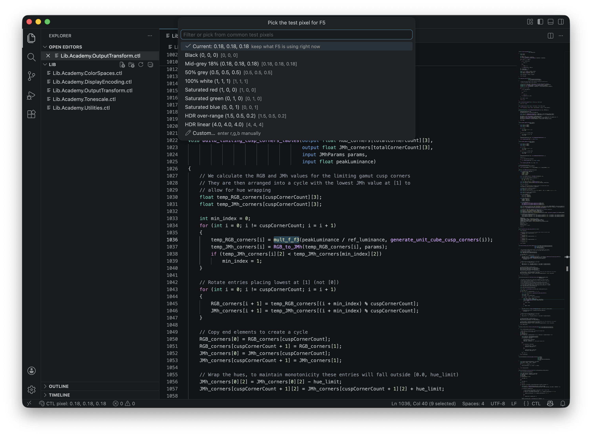
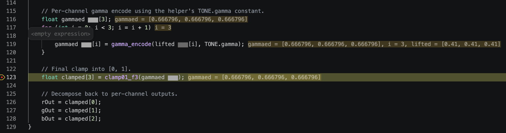
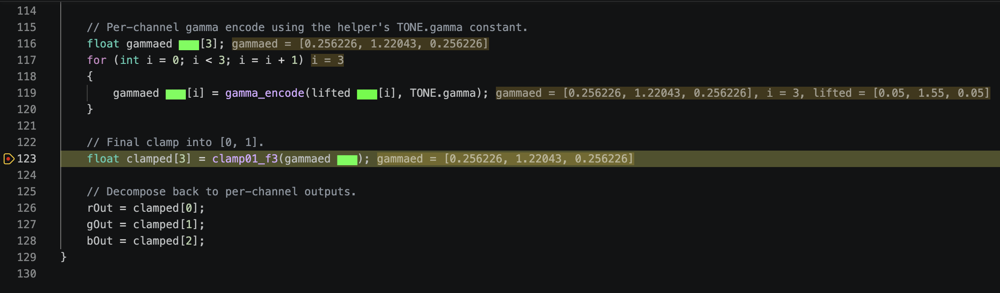
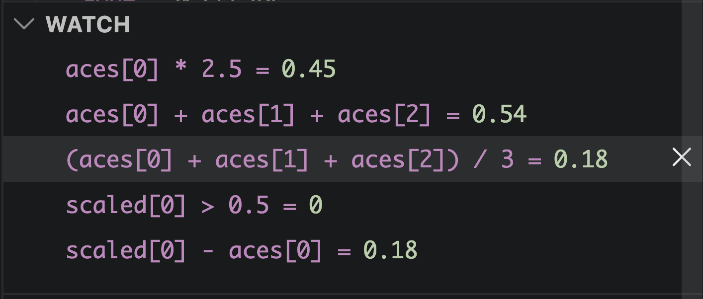
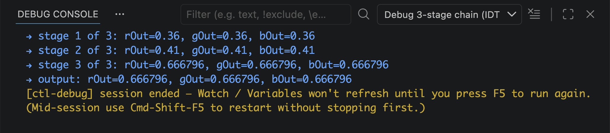
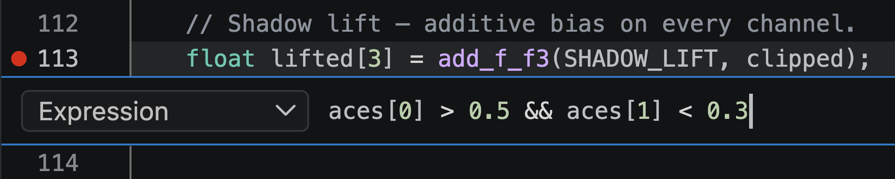

# CTL Debug for VS Code

[](https://marketplace.visualstudio.com/items?itemName=ctl-org.ctl-debug)
[](https://marketplace.visualstudio.com/items?itemName=ctl-org.ctl-debug)
[](https://marketplace.visualstudio.com/items?itemName=ctl-org.ctl-debug&ssr=false#review-details)
[](https://github.com/aforsythe/vscode-ctl-debug/actions/workflows/ci.yml)
[](LICENSE)

> Single-pixel debugger for **CTL** (Color Transformation Language)
> with inline values, color swatches, and a status-bar pixel picker.
> Set a breakpoint, click a color, hit F5.

<p align="center">
  
</p>

---

## Install

1. **Install the extension** from the VS Code Marketplace
   (search for **CTL Debug**), or grab the `.vsix` from the
   [latest GitHub release](https://github.com/aforsythe/vscode-ctl-debug/releases)
   and `code --install-extension ctl-debug-*.vsix`.
2. **Get the `ctldap` binary** — built from the
   [CTL repo](https://github.com/ampas/CTL) with
   `-DCTL_ENABLE_DEBUGGER=ON`:
   ```sh
   git clone https://github.com/ampas/CTL.git
   cd CTL
   cmake -B build -DCMAKE_BUILD_TYPE=Debug -DCTL_ENABLE_DEBUGGER=ON
   cmake --build build --target ctldap -j8
   ```
   The extension auto-detects `ctldap` on `$PATH` and in common build
   directories on first use; you don't have to configure anything.

That's it.  No language server to start, no daemons to manage.

---

## Quickstart

1. **Open your CTL project** in VS Code.
2. **Cmd-Shift-P → CTL: Initialize debug configuration**.  This picks
   the active `.ctl`, finds `ctldap`, and writes a minimal
   `.vscode/launch.json`.
3. **Click the pixel indicator** in the bottom-left status bar
   (`🎨 CTL pixel: 0.18, 0.18, 0.18`) and pick a test pixel — preset
   greys, saturated R/G/B, HDR over-range, or your own custom value.
   <p></p>
4. **Click in the gutter** to set a breakpoint.
5. **Press F5.**  Execution pauses at the BP with the pixel you
   picked.  See the next section for what you'll see.

To iterate: change the pixel in the status bar, hit F5 again.  No
edits to `launch.json`, no config switching.

---

## What you get while paused

### Inline values

Variable values render right next to the identifiers in the source.
No more switching focus to the Variables panel for a quick lookup.

<p></p>

### Color swatches

Any `float[3]` or `float[4]` that looks like a color gets a colored
block decoration.  The killer feature for color-grading work — see
the actual color of `aces`, `scaled`, `lifted`, etc. evolve as you
step through the pipeline.

<p></p>

### Watch panel — full expression evaluator

Pin arbitrary expressions, not just bare names:

```
boosted * 2
aces[0] - aces[2]
(scaled[0] + scaled[1] + scaled[2]) / 3
boosted > 0.5 && rIn < 1
```

Bare names, arithmetic, comparisons, logical combinators, array
indexing, and parens are all supported.

<p></p>

### Multi-stage chain debugging

Pipelines with one transform feeding another show each stage's
outputs live in the Debug Console as it finishes.  Set breakpoints
in every file along the chain — they all fire.

<p></p>

### Conditional breakpoints + logpoints

Right-click a breakpoint to attach a condition (`aces[0] > 0.5 &&
aces[2] < 0.3`) or convert it to a non-pausing logpoint
(`pixel = ${aces[0]}, ${aces[1]}, ${aces[2]}`).  The same evaluator
that powers Watch handles both.

<p></p>

### Plus the usual

Step in / over / out (F11 / F10 / Shift+F11), restart
(Cmd-Shift-F5 reuses the current launch + status-bar pixel),
hover-to-evaluate, struct field expansion, deeper-frame variable
inspection, post-termination hint in the Debug Console.

---

## Settings

- **`ctl.ctldapPath`** — absolute path to `ctldap`.  Auto-populated
  on first use; override under Settings → Extensions → CTL Debug, or
  via **CTL: Locate ctldap binary…**.
- **`ctl.openProgramOnLaunch`** (default `true`) — when F5 starts a
  CTL session, also open the `.ctl` file(s) referenced by the launch
  configuration.  Especially useful for chain configs where you'd
  otherwise have to hunt down each stage.

## Palette commands

- **CTL: Initialize debug configuration** — auto-detect ctldap +
  write a minimal `.vscode/launch.json`.
- **CTL: Add launch configuration…** — append another entry.
- **CTL: Locate ctldap binary…** — re-point to a different ctldap.
- **CTL: Pick test pixel for F5…** — same picker as the status bar.
- **CTL: Open files for a launch configuration…** — open the `.ctl`
  files referenced by a chosen launch entry without running.

---

## launch.json reference

`program` (single file) or `programs` (chain) is the only required
field.  Everything else has a default.

| field | type | default | required | description |
|---|---|---|---|---|
| `program` | string | `${file}` | one of program/programs | Path to the `.ctl` to debug (single-file form) |
| `programs` | string[] | — | one of program/programs | Paths to `.ctl` files to chain (alternative to single `program`) |
| `function` | string | `"main"` | no | CTL function to invoke (qualified, e.g., `myns::main`) |
| `functions` | string[] | per-stage `"main"` | no | Functions per chain stage. Missing entries default to `main`. |
| `modulePaths` | string[] | `[]` | no | Additional directories prepended to the `import` search path (combined with `$CTL_MODULE_PATH` and per-file parent directories) |
| `pixel` | number[] | (status-bar pixel; mid-grey `[0.18, 0.18, 0.18]` until the user picks otherwise) | no | Pixel value (3 or 4 floats).  Bound to per-channel scalars (`rIn`/`gIn`/`bIn`/`aIn`, `r/g/b/a`, `R/G/B/A`, `red/green/blue/alpha`) or to an aggregate (`rgbIn[3]`, `rgbaIn[4]`, `rgb`, `rgba`, `pixel`, `color`).  Case-insensitive.  When omitted, F5 uses the live status-bar pixel; specify here only to LOCK a configuration to a fixed value. |
| `params` | object | `{}` | no | Uniform-input bindings by name, e.g. `{"gain": 1.5}`.  Each key matches a CTL `input uniform <type> <name>` arg. |
| `stopOnEntry` | boolean | `false` | no | Pause on the first instruction |
| `pixelEvolution` | boolean | `false` | no | When `true`, ctldap emits a `→ paused name=[…]` Debug Console line at every pause summarising every color-shaped (`float[3]` / `float[4]`) local in scope. |
| `ctldap` | string | (user setting) | no | Path to the ctldap binary.  Overrides the `ctl.ctldapPath` user setting for this configuration. |

### Multi-stage chains

```json
{
    "type": "ctl",
    "request": "launch",
    "name": "Debug ACES chain (IDT → RRT → ODT)",
    "programs": [
        "${workspaceFolder}/IDT.ctl",
        "${workspaceFolder}/RRT.ctl",
        "${workspaceFolder}/ODT.ctl"
    ],
    "pixel": [0.18, 0.18, 0.18],
    "modulePaths": ["${workspaceFolder}/aces-dev/transforms/ctl/lib"]
}
```

`functions` is omitted because all three entrypoints are named
`main`.  If any stage uses a different entrypoint, supply a parallel
array; entries that are still `main` can be passed as the literal
string `"main"` or left empty:

```json
"programs":  ["IDT.ctl",   "RRT.ctl", "ODT.ctl"],
"functions": ["IDT::run",  "main",    "main"]
```

The output pixel of each stage becomes the input pixel of the
following stage by name match (`rOut` → `rIn`, etc.); breakpoints
fire in every file along the chain.

---

## Known limitations

- **Single-pixel only.**  For image-level bugs, narrow to one pixel
  first (`ctlrender --pixel`), then load that value into the
  debugger.

## Contributing

PRs welcome — see [`CONTRIBUTING.md`](CONTRIBUTING.md).  Architecture
notes in [`docs/DEVELOPMENT.md`](docs/DEVELOPMENT.md).  End-to-end
verification flow in [`docs/MANUAL_TESTING.md`](docs/MANUAL_TESTING.md).

## License

[Apache 2.0](LICENSE).
